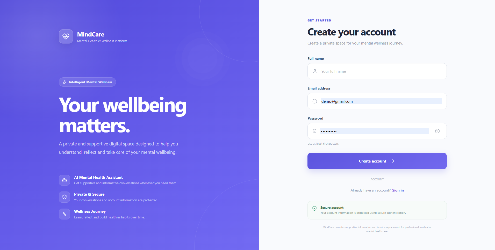
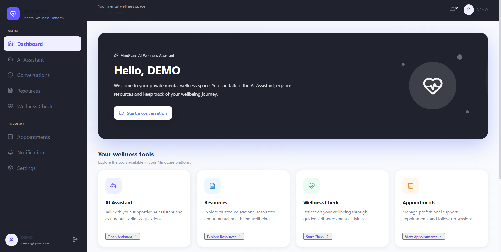
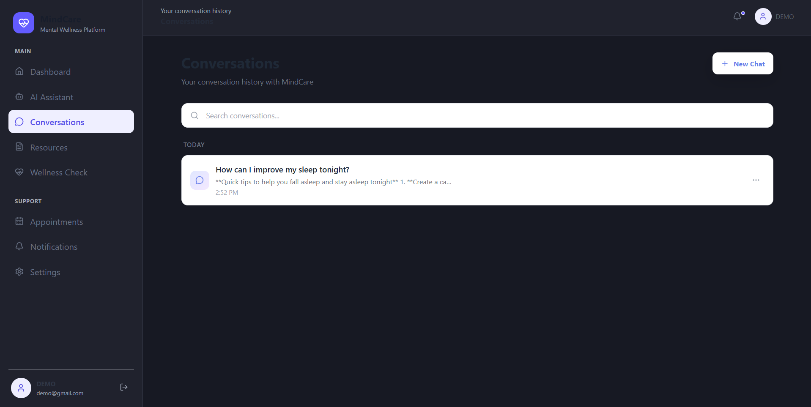
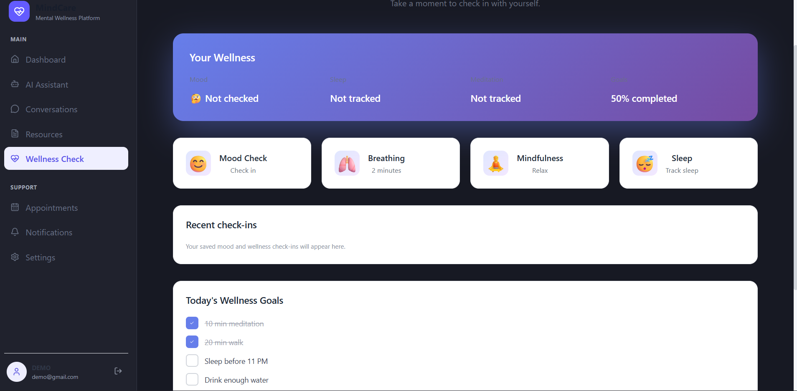
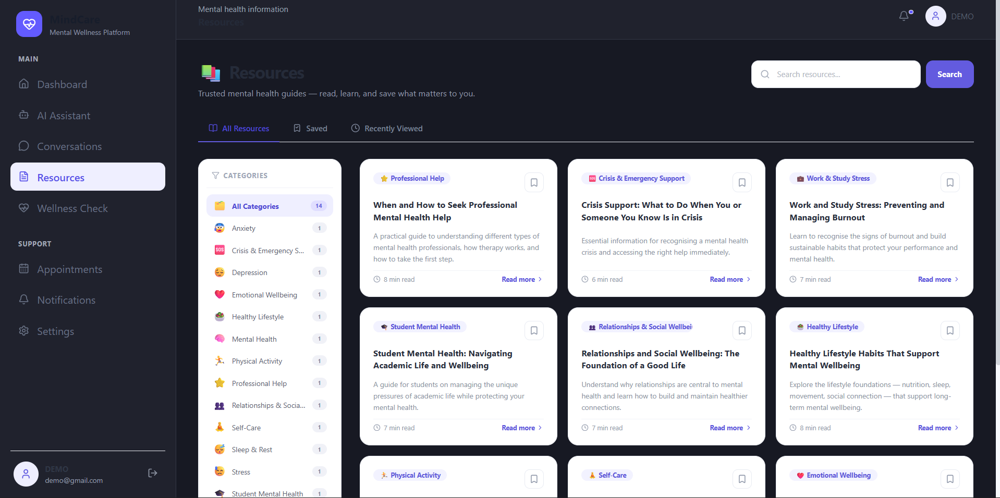
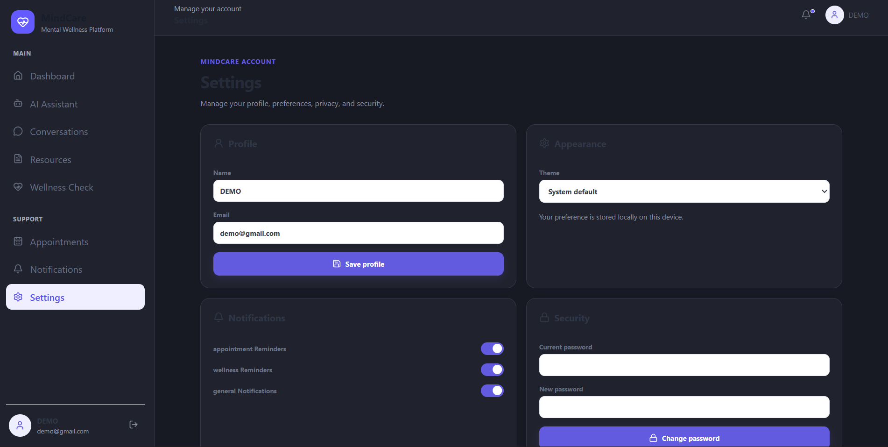

# MindCare — Mental Health Agentic RAG Platform

MindCare is a web-based mental health and wellness support platform that combines conversational AI, Agentic Retrieval-Augmented Generation (RAG), wellness tracking, professional support features, notifications, and role-based administration in a single full-stack web application.

The system is designed to provide users with accessible, supportive, and context-aware mental health and wellness assistance while maintaining clear boundaries around clinical diagnosis and treatment.

[🚀 Live Demo](https://mental-health-agentic-rag-4o4m.vercel.app) &nbsp;|&nbsp; [💻 GitHub Repository](https://github.com/mgozirafael414-eng/mental-health-agentic-rag)

---

## What is MindCare?

MindCare is a conversational wellness platform where users can chat with an AI assistant grounded in trusted mental health resources, track their personal wellness through structured check-ins, and access professional support features — all from one place.

Administrators and mental health professionals have dedicated dashboards for managing users, appointments, notifications, and professional communications.

---

## ✨ Key Features

### 🤖 AI Mental Health Assistant

A conversational AI assistant that provides supportive, context-aware responses for topics such as stress, study pressure, emotional wellbeing, motivation, relationships, and general wellness.

The assistant uses the Agentic RAG pipeline to retrieve relevant information from the project's knowledge base before generating responses, keeping answers grounded in trusted mental health resources.

---

### 📚 Agentic RAG

MindCare uses Retrieval-Augmented Generation to improve the relevance of AI responses.

The RAG pipeline:

1. Mental health resource documents are prepared
2. Documents are ingested through the ingestion pipeline
3. Content is split into text chunks
4. Embeddings are generated for each chunk
5. Relevant chunks are retrieved based on user queries
6. Retrieved context is assembled for the LLM
7. The LLM generates a grounded, context-aware response

---

### 🧠 Wellness Check

Users can record personal wellness information including:

- Mood
- Stress levels
- Energy
- Sleep quality

The system stores wellness check-ins and makes the user's recent wellness data available to the AI assistant to provide more personalized support. The assistant uses actual stored wellness records and does not fabricate missing values.

---

### 💬 Conversations

Users can maintain ongoing conversations with the MindCare assistant:

- Start new conversations
- Send and receive messages
- View and continue previous conversations
- Personalized conversational context per user

---

### 🔔 Notifications

Administrators can send platform notifications to:

- All active users
- Individual users
- Professionals
- Specific users or professionals

Users can view their notifications from within their account.

---

### 👨‍⚕️ Professional Support

Dedicated functionality for professional users including:

- Professional dashboard
- User support tools
- Communication features
- Notes
- Appointments

---

### 🛡️ Administration

An administrative interface for managing platform operations:

- User management
- Professional management
- Appointments
- Notifications
- Dashboard overview
- Administrative communication

---

### 📂 Resource Ingestion

Mental health resource documents can be ingested through the RAG pipeline, processed into chunks, embedded, and stored for retrieval by the AI assistant.

---

## 🏗️ System Architecture

```
┌─────────────────────────────────────────────────┐
│               User (Browser)                    │
└─────────────────────┬───────────────────────────┘
                      │
                      │ HTTP / REST API (JSON)
                      ▼
┌─────────────────────────────────────────────────┐
│           React + Vite  Frontend                │
│                                                 │
│  Auth · Chat · Wellness · Resources             │
│  Notifications · Professional · Admin           │
└─────────────────────┬───────────────────────────┘
                      │
                      │ HTTP / REST API
                      ▼
┌─────────────────────────────────────────────────┐
│         Express + Node.js  Backend              │
│                                                 │
│  Middleware                                     │
│  ├── JWT Auth          (authMiddleware)         │
│  ├── Role Guard        (roleMiddleware)         │
│  └── Professional Gate (professionalMiddleware) │
│                                                 │
│  API Routes / Controllers                       │
│  ├── /api/auth          Authentication          │
│  ├── /api/users         User management         │
│  ├── /api/conversations Conversation CRUD       │
│  ├── /api/messages      Message CRUD            │
│  ├── /api/chat          AI chat endpoint        │
│  ├── /api/wellness      Wellness check-ins      │
│  ├── /api/resources     Resource library        │
│  ├── /api/appointments  Appointments            │
│  ├── /api/notifications Notifications           │
│  ├── /api/professional  Professional features   │
│  ├── /api/professional-communication            │
│  └── /api/admin         Administration          │
│                                                 │
│  LLM Service (llmService.js)                    │
│  ├── 1. Receive user message                    │
│  ├── 2. Retrieve relevant chunks (RAG)          │
│  ├── 3. Build context prompt                    │
│  ├── 4. Inject wellness personalisation         │
│  ├── 5. Send to Groq API                        │
│  └── 6. Return AI response                      │
│                                                 │
│  Agentic RAG Pipeline                           │
│  ├── embeddingService  (HuggingFace local)      │
│  │    Xenova/all-MiniLM-L6-v2                   │
│  ├── retrievalService  (pgvector similarity)    │
│  └── contextBuilder    (prompt assembly)        │
└──────┬──────────────────────────────────────────┘
       │
       │ Prisma ORM
       ▼
┌─────────────────────────────────────────────────┐
│        PostgreSQL  (+ pgvector extension)       │
│                                                 │
│  Users · Conversations · Messages               │
│  Documents · DocumentChunks (vectors)           │
│  Resources · ResourceBookmarks                  │
│  WellnessCheckIns · Appointments                │
│  Notifications · AuditLogs                      │
│  ProfessionalConversations · SessionNotes       │
└──────┬──────────────────────────────────────────┘
       │
       │ External API call
       ▼
┌─────────────────────────────────────────────────┐
│       Groq API  (openai/gpt-oss-120b)           │
│       LLM response generation                   │
└─────────────────────────────────────────────────┘
```

MindCare uses a separated frontend/backend architecture. The React + Vite frontend communicates with the Express backend over a REST API. All data is persisted in PostgreSQL via Prisma ORM, with the `pgvector` extension enabling vector similarity search for RAG retrieval. Text embeddings are generated locally on the backend using a HuggingFace transformer model (`Xenova/all-MiniLM-L6-v2`). AI responses are generated by calling the Groq API. JWT-based authentication and role-based middleware protect all private endpoints.

---

## 🧠 Agentic RAG Workflow

```
Mental Health Resource Documents
  ↓
Document Ingestion
  ↓
Text Chunking
  ↓
Embedding Generation
  ↓
Resource Retrieval (vector/similarity search)
  ↓
Context Construction
  ↓
LLM Response Generation
  ↓
AI Assistant Response
```

---

## 🛠️ Technology Stack

### Frontend

| Technology   | Purpose                    |
| ------------ | -------------------------- |
| React        | UI framework               |
| Vite         | Build tool & dev server    |
| JavaScript   | Application language       |
| CSS          | Styling                    |
| Lucide React | Icon library               |

### Backend

| Technology   | Purpose                         |
| ------------ | ------------------------------- |
| Node.js      | Runtime                         |
| Express      | Web framework / REST API        |
| JWT          | Authentication & authorization  |

### Database

| Technology   | Purpose                      |
| ------------ | ---------------------------- |
| PostgreSQL   | Primary relational database  |
| Prisma ORM   | Database access & migrations |

### AI / RAG

| Technology                    | Purpose                              |
| ----------------------------- | ------------------------------------ |
| Groq LLM API                  | Language model for response generation |
| Text Embeddings               | Semantic search over knowledge base  |
| Retrieval-Augmented Generation | Grounded, context-aware responses   |
| Mental health resource documents | Knowledge base                    |

### Deployment

| Platform               | Purpose                   |
| ---------------------- | ------------------------- |
| Vercel                 | Frontend & backend hosting |
| Managed PostgreSQL     | Production database        |

---

## 👥 User Roles

| Role           | Description                                                  |
| -------------- | ------------------------------------------------------------ |
| `USER`         | Regular platform user — can chat, do wellness checks, manage conversations, and view notifications |
| `PROFESSIONAL` | Mental health/wellness professional — has dedicated dashboard and user support tools |
| `ADMIN`        | Platform administrator — manages users, professionals, appointments, and notifications |
| `OWNER`        | Highest-level administrative role with full platform access  |

---

## 📸 Screenshots

### Login



### Dashboard



### Conversations



### AI Assistant


### Wellness



### Resources



### Settings



---

## 🚀 Live Demo

The deployed application is available at:

**[https://mental-health-agentic-rag-4o4m.vercel.app](https://mental-health-agentic-rag-4o4m.vercel.app)**

> Note: The live demo connects to a production PostgreSQL database. Some features require account registration.

---

## ⚙️ Local Development

### 1. Clone the repository

```bash
git clone https://github.com/mgozirafael414-eng/mental-health-agentic-rag.git
cd mental-health-agentic-rag
```

---

### 2. Backend Setup

```bash
cd backend
npm install
```

Create a `.env` file in the `backend/` directory:

```env
DATABASE_URL=your_postgresql_connection_string
JWT_SECRET=your_jwt_secret
GROQ_API_KEY=your_groq_api_key
```

> **Never commit real secrets to GitHub.** Use environment variables in local development and deployment platforms.

Run Prisma:

```bash
npx prisma generate
npx prisma db push
```

Start the backend:

```bash
npm run dev
```

The local backend runs on `http://localhost:5000`

---

### 3. Frontend Setup

Open a new terminal:

```bash
cd frontend
npm install
```

Create a `.env` file in the `frontend/` directory:

```env
VITE_API_URL=http://localhost:5000
```

Start the frontend:

```bash
npm run dev
```

Vite will provide the local frontend URL (typically `http://localhost:5173`).

---

## 🔑 Environment Variables

| Variable       | Purpose                           |
| -------------- | --------------------------------- |
| `DATABASE_URL` | PostgreSQL database connection    |
| `JWT_SECRET`   | JWT authentication secret         |
| `GROQ_API_KEY` | LLM API access (Groq)             |
| `VITE_API_URL` | Frontend → backend API URL        |

**Never commit real API keys, database passwords, JWT secrets, or other credentials to GitHub.**

---

## 🔐 Privacy and Safety

MindCare is designed as a supportive wellness application, not a clinical tool.

The AI assistant:

- Provides supportive wellness information
- Encourages healthy coping strategies
- **Does not** diagnose mental health conditions
- **Does not** prescribe medication
- **Does not** pretend to be a licensed clinician
- Protects user-specific information
- Uses authenticated user context for personalization only

**For serious or immediate safety concerns, users should seek appropriate emergency services or professional mental health support.**

---

## 🧪 Testing

Recommended test coverage areas:

### User
- Registration and login
- Chat with AI assistant
- New conversation / conversation history
- Wellness Check
- Notifications
- Resources

### Administrator
- Admin login
- Dashboard overview
- User and professional management
- Appointments
- Notifications

### Professional
- Professional login
- Dashboard
- User support, communication, notes, appointments

### AI / RAG
- General wellness questions
- Study stress questions
- Personalized wellness questions (using stored wellness data)
- Resource-grounded responses
- Out-of-scope question handling
- Safety-related conversation handling

---

## 📁 Project Structure

```
mental-health-agentic-rag/
│
├── backend/
│   ├── prisma/
│   │   ├── migrations/
│   │   └── schema.prisma
│   │
│   └── src/
│       ├── controllers/
│       │   ├── adminController.js
│       │   ├── appointmentController.js
│       │   ├── authController.js
│       │   ├── chatController.js
│       │   ├── professionalCommunicationController.js
│       │   ├── professionalController.js
│       │   └── wellnessController.js
│       │
│       ├── rag/
│       │   ├── documents/
│       │   ├── embeddings/
│       │   ├── scripts/
│       │   │   └── ingestDocuments.js
│       │   └── services/
│       │       ├── contextBuilder.js
│       │       ├── documentIngestionService.js
│       │       └── retrievalService.js
│       │
│       ├── routes/
│       │   ├── adminRoutes.js
│       │   ├── authRoutes.js
│       │   ├── chatRoutes.js
│       │   ├── conversationRoutes.js
│       │   ├── professionalCommunicationRoutes.js
│       │   └── wellnessRoutes.js
│       │
│       ├── services/
│       │   └── llmService.js
│       │
│       └── server.js
│
├── frontend/
│   └── src/
│       ├── App.jsx
│       ├── App.css
│       ├── components/
│       │   └── Auth.jsx
│       └── services/
│           └── api.js
│
└── README.md
```

---

## 📌 Project Status

MindCare is an **actively developed** project.

**Implemented and functional:**

- React + Vite frontend
- Express + Node.js REST API backend
- JWT authentication and role-based access
- PostgreSQL database with Prisma ORM
- AI chatbot (conversational assistant)
- Agentic RAG architecture
- Wellness Check module
- Admin dashboard
- Notifications system
- Professional functionality
- Appointments
- Resource ingestion pipeline
- Personalized wellness context

> Some production integrations may still require additional testing before the system is considered fully production-ready.

---

## 👨‍💻 Developer

**Rafael Mgozi**

- GitHub: [https://github.com/mgozirafael414-eng](https://github.com/mgozirafael414-eng)
- Repository: [https://github.com/mgozirafael414-eng/mental-health-agentic-rag](https://github.com/mgozirafael414-eng/mental-health-agentic-rag)

---

MindCare is a learning and development project focused on responsible AI, Agentic RAG, full-stack web development, and accessible mental health and wellness support.

---

## 📄 License

This project is currently under development. Add an appropriate open-source license before distributing publicly if required.
